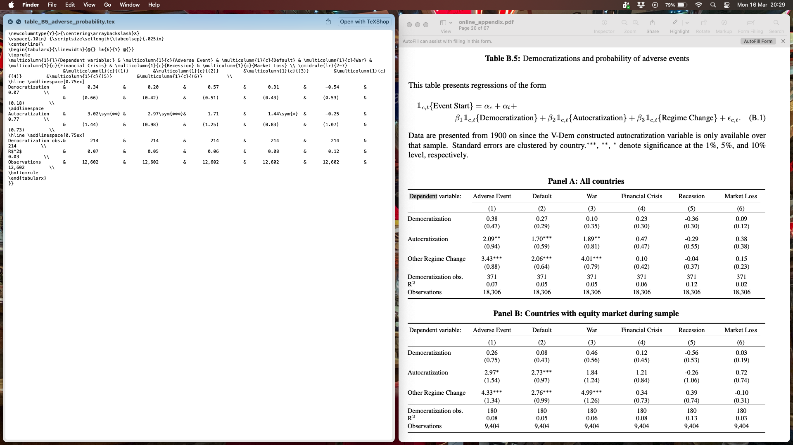

# Paper Identification

|           |                      |
|-----------|----------------------|
| ID        |  |
| Author    |    |
| Title     |     |
| Iteration |     |

Some useful information up front:

-   [JPE Data and Code Availability Policy](https://www.journals.uchicago.edu/journals/jpe/datapolicy)
-   [Step by step guidance from Data Editor for Authors](https://jpedataeditor.github.io/)
-   [Template README](https://social-science-data-editors.github.io/template_README/)

# Summary

In assessing compliance with our [Data and Code Availability Policy](https://www.journals.uchicago.edu/journals/jpe/datapolicy), our reproducibility team has identified the following issues, which we ask you to address:

# General

-   [ ] Data Availability and Provenance Statements
    -   [ ] Statement about Rights - Part 1: Right to use the data (e.g. *did the authors lawfully obtain the data*)
    -   [ ] Statement about Rights - Part 2: Right to publish the data (e.g. *are human subjects involved and did permission been granted to publish their data?*)
    -   [ ] License for Data (optional, but recommended)
    -   [x] Details on each Data Source
-   [x] Dataset list
-   [x] Computational requirements
    -   [x] Software Requirements
    -   [ ] Controlled Randomness (as necessary)
    -   [x] Memory, Runtime, and Storage Requirements
-   [x] Description of programs/code
    -   [x] License for Code (Optional, but recommended)
-   [x] List of tables and programs
-   [ ] References (Optional, but recommended)

# High-level Description of Research Project

*This research project...*

-   [x] uses observational data.
-   [x] uses *confidential* observational data.
-   [ ] uses data generated via experiment or trial by the authors (in field or lab).
    -   [ ] For lab experiments: The code to implement the experimental protocol (z-Tree, o-Tree etc) is included in the package.
    -   [ ] A PDF copy of IRB approval is contained in the package.
    -   [ ] A PDF document outlining the design of the experiment, including information on the selection and eligibility of participants is included.
    -   [ ] A PDF copy of the instructions given to participants in both original language and an English translation is included.
-   [ ] uses data generated via survey by the authors (in field or online)
    -   [ ] The programs used to administer the survey (e.g. qualtrics survey file) are included.
    -   [ ] A PDF copy of IRB approval is contained in the package.
    -   [ ] A PDF of the original questionaire(s) and information on the selection and eligibility of participants is included.
-   [ ] is a simulation study: the data are generated by an algorithm.
-   [ ] is a numerical illustration: no data are used but code is used to produce illustrative output (tables, figures)

# Data description

For any data that cannot be provided as part of the replication package, please provide the following information as part of the README.

> {REQUIRED} Please specify how long the data will be preserved in the restricted-access location.

> {REQUIRED} Please provide affirmation of support for replication checks. - As per the [JPE policy](https://jpedataeditor.github.io/policy.html), "In cases where data cannot be published in an openly accessible trusted data repository like the JPE dataverse, authors who have requested an exemption to publish them at the time of first submission must commit to preserving the data and code for a period of no less than five years following the publication of the paper. They should also provide reasonable assistance to requests for clarification and replication."

> {REQUIRED} Please provide a codebook for the data. - The codebook should at a minimum describe the variables obtained from the data source, in a manner that will let others verify that they have obtained a substantially similar dataset if successfully obtaining access to the data.

## Data Sources

Input data sources used to build the analysis data. 

| Data Source | Location | Dataset | Public | Private | Access Described | DOI / URL |
|---|---|---|---|---|---|---|
| Correlates of War (CoW) | datastore/raw/cow/ | militarized_interstate_disputes/MIDB_4.2.csv | Yes | No | Yes | Yes |
| Correlates of War (CoW) | datastore/raw/cow/ | militarized_interstate_disputes/MIDLOCI_2.0.csv | Yes | No | Yes | Yes |
| Correlates of War (CoW) | datastore/raw/cow/ | wars/Inter-StateWarData_v4.0.dta | Yes | No | Yes | Yes |
| Correlates of War (CoW) | datastore/raw/cow/ | wars/Extra-StateWarData_v4.0.dta | Yes | No | Yes | Yes |
| Correlates of War (CoW) | datastore/raw/cow/ | wars/Intra-StateWarData_v4.1.dta | Yes | No | Yes | Yes |
| Fraser Institute’s Economic Freedom Index (EFI) | datastore/raw/economic_freedom/ | efi_data.dta | Yes | No | Yes | Yes |
| Global Financial Data (GFD/Finaeon) | datastore/raw/gfd/ | country_series/ | No | Yes | Yes | Yes |
| Global Financial Data (GFD/Finaeon) | datastore/raw/gfd/ | gfd_data_series_list.xlsx | No | Yes | Yes | Yes |
| Global Financial Data (GFD/Finaeon) | datastore/raw/gfd/ | gfd_recessions.csv | No | Yes | Yes | Yes |
| Global Financial Data (GFD/Finaeon) | datastore/raw/gfd/ | govt_rev_gdp.dta | No | Yes | Yes | Yes |
| Global Financial Data (GFD/Finaeon) | datastore/raw/gfd/ | supplements/extraTotalReturnsClean.xlsx | No | Yes | Yes | Yes |
| Global Financial Data (GFD/Finaeon) | datastore/raw/gfd/ | supplements/price_earnings_clean.csv | No | Yes | Yes | Yes |
| International Crisis Behavior (ICB) | datastore/raw/icb/ | icb2v12.csv | Yes | No | Yes | Yes |
| Jordà-Schularick-Taylor (JST) Macrohistory Database | datastore/raw/jst/ | JSTdatasetR5.dta | Yes | No | Yes | Yes |
| Maddison Historical Statistics | datastore/raw/ggdc/ | mpd2020.dta | Yes | No | Yes | Yes |
| Penn World Table | datastore/raw/pwt/ | pwt100.dta | Yes | No | Yes | Yes |
| Penn World Table | datastore/raw/pwt/ | pwt100-capital-detail.dta | Yes | No | Yes | Yes |
| Penn World Table | datastore/raw/pwt/ | pwt100-labor-detail.dta | Yes | No | Yes | Yes |
| Relative Political Capacity Dataset (RPC) | datastore/raw/arpc/ | arpc_2020_comp.dta | Yes | No | Yes | Yes |
| Standardized World Income Inequality Database (SWIID) | datastore/raw/swiid/ | swiid9_0_summary.csv | Yes | No | Yes | Yes |
| Varieties of Democracy (V-Dem) | datastore/raw/vdem/ | V-Dem-CY+Others-v8.dta | Yes | No | Yes | Yes |
| Varieties of Democracy (V-Dem) | datastore/raw/vdem/ | V-Dem-CY-Full+Others-v10.dta | Yes | No | Yes | Yes |
| Wharton Research Data Services (WRDS) | datastore/raw/wrds/ | factset_annual_fiscal.dta | No | Yes | Yes | Yes |
| Wharton Research Data Services (WRDS) | datastore/raw/wrds/ | ibes_global_actual.dta | No | Yes | Yes | Yes |
| World Religion Dataset (WRD) | datastore/raw/cow/religion/ | WRP_national.csv | Yes | No | Yes | Yes |
| Data from Published Papers and Other Events | datastore/raw/other_events/ | reinhart_rogoff_defaults.dta | Yes | No | Yes | Yes |
| Data from Published Papers and Other Events | datastore/raw/other_events/ | reinhart_rogoff_financial_crisis.csv | Yes | No | Yes | Yes |
| Data from Published Papers and Other Events | datastore/raw/other_events/ | assassinations_data.dta | Yes | No | Yes | Yes |
| Data from Published Papers and Other Events | datastore/raw/other_events/ | HOG_death.csv | Yes | No | Yes | Yes |
| Data from Published Papers and Other Events | datastore/raw/other_events/ | country_names_to_iso3.dta | Yes | No | Yes | Yes |
| Country Code Crosswalks | datastore/raw/crosswalks/ | country_name_to_iso3.csv | Yes | No | Yes | Yes |
| Country Code Crosswalks | datastore/raw/crosswalks/ | cow_country_codes_to_iso3.csv | Yes | No | Yes | Yes |
| Country Code Crosswalks | datastore/raw/crosswalks/ | ibes_country_to_iso3_codes.csv | Yes | No | Yes | Yes |
| Country Code Crosswalks | datastore/raw/crosswalks/ | icb_country_code_to_iso3.csv | Yes | No | Yes | Yes |
| Country Code Crosswalks | datastore/raw/crosswalks/ | iso2_codes_to_iso3_codes.csv | Yes | No | Yes | Yes |
| Country Code Crosswalks | datastore/raw/crosswalks/ | region_map.dta | Yes | No | Yes | Yes |
| Country Code Crosswalks | datastore/raw/crosswalks/ | valid_iso3_codes.dta | Yes | No | Yes | Yes |
| Foreign Direct Investment (FDI) | datastore/raw/fdi/ | fdi_inflows_raw.csv | Yes | No | Yes | Yes |
| Foreign Direct Investment (FDI) | datastore/raw/fdi/ | fdi_outflows_raw.csv | Yes | No | Yes | Yes |
| Regime Change Data | datastore/raw/regime_change/ | DDCGdata_final.dta | Yes | No | Yes | Yes |
| Regime Change Data | datastore/raw/regime_change/ | ERT.csv | Yes | No | Yes | Yes |
| Regime Change Data | datastore/raw/regime_change/ | historical_events_for_democratization.csv | Yes | No | Yes | Yes |
| Regime Change Data | datastore/raw/regime_change/ | vod_democratizations.csv | Yes | No | Yes | Yes |
| World Income Inequality Database (WIID) | datastore/raw/wiid/ | wiidcountry.dta | Yes | No | Yes | Yes |

# Requirements

-   [x] README is in TXT, MD, or PDF format

-   [x] README is accessible at the root of the package (not inside a folder)

-   [ ] Title conforms to guidance (starts with "Data and Code for: Title of Paper" or "Code for: Title of Paper", is properly capitalized)

-   [ ] Authors (with affiliations) are listed in the same order as on the paper

> {REQUIRED} Please review the title of the deposit as per our guidelines.

> {REQUIRED} Please review authors and affiliations on the deposit. In general, they are the same, and in the same order, as for the manuscript; however, authors can deviate from that order.

## Stated Requirements

``The code was last run on a 10-core Intel-based laptop with WindowsOS version 11 Enterprise with 50GB of free space. Computation took 21 minutes"

-   [x] Software Requirements specified as follows:
    -   Python >=3.11, <3.13
    -   Stata (code was last run with version 19)
-   [x] Computational Requirements specified as follows:
    -   2 GB - 25 GB required storage space
-   [x] Time Requirements specified as follows:
    -   10-60 minutes
<!-- -   [ ] Requirements are complete. -->


# Analyzing Data and Code Files











## Code description

The author implements the replication using a SCons-based reproducible research pipeline, orchestrated through uv, which automatically runs the Python and Stata scripts needed to generate the paper’s tables and results.

There are 36 `.do` scripts which generate the analysis data. 

There are 10 `.do` and 2 `.py` scripts which generate the main tables.

There are 7 `.do` and 1 `.py` scripts which generate the main figures.

There are 16 `.do` and 1 `.py` scripts which generate the appendix tables.

There are 11 `.do` scripts which generate the appendix figures.

**Summarizing the Data Cleaning Code**

*source/derived/01_events/*

| Dataset Produced | Program |
|---|---|
|  | 01_create_valid_iso3_codes.do |
|  | 02_create_pre1900_dem.do |
|  | 03_create_regime_change.do |
|  | 04_create_coup_detat.do |
|  | 05_create_financial_crises.do |
|  | 06_create_sovereign_default.do |
|  | 07_create_hog_deaths.do |
|  | 08_create_international_crises.do |
|  | 09_create_recession.do |
|  | 10_create_interstate_wars.do |
|  | 11_create_intrastate_wars.do |
|  | 12_create_extrastate_wars.do |
|  | 13_create_militarized_disputes.do |
|  | 14_combine_all_events.do |


*source/derived/02_macro_political/*

| Dataset Produced | Program |
|---|---|
|  | 01_create_inflation.do |
|  | 02_create_pwt_data.do |
|  | 03_create_gdp.do |
|  | 04_create_vdem_datasets.do |
|  | 05_create_portion_catholic.do |
|  | 06_create_gini.do |
|  | 07_create_tax_rates.do |
|  | 08_create_gov_rev.do |
|  | 09_create_economic_competition.do |
|  | 10_create_fdi.do |


*source/derived/03_assets/*

| Dataset Produced | Program |
|---|---|
|  | 01_factset_clean.do |
|  | 02_ibes_global_clean.do |
|  | 03_create_dividend_yields.do |
|  | 04_create_equity_returns.do |
|  | 05_create_fixed_income.do |
|  | 06_create_home_country_bond_rate.do |
|  | 07_create_excess_and_abnormal_returns.do |
|  | 08_create_cashflow_growth.do |
|  | 09_create_other_asset_market_variables.do |
|  | 10_create_return_news.do |


*source/derived/04_merging/*

| Dataset Produced | Program |
|---|---|
|  | 01_create_section_3_and_5_data.do |
|  | 02_create_section_4_data.do |


**Summarizing code producing Tables and Figures:**

If a table or figure is indicated as reproduced with no additional comments, this means it was exactly reproduced. 

| Figure/Table \# | Program | Filename | Reproduced? |
|------------------|------------------|------------------|------------------|
| **Main Tables** | `source/analysis/main/tables` | `source/tables/raw` |  |
| Table 1 | 01_table_1_change_in_log_dividend_yield.do | table_1_change_in_log_dividend_yields.tex | Yes - one tiny SE mismatch 5.83 vs 5.82 |
| Table 2 | 02_table_2_cashflow_growth.do | table_2_cashflow_growth.tex | Yes - one tiny SE mismatch 1.79 vs 1.80 |
| Table 3 | 03_table_3_democratization_vs_other_political_risk.do | table_3_democratization_vs_other_political_risk.tex | Yes - 1 small p value mismatch 0.68 vs 0.7 and 7 small SE mismatches 6.71 vs 6.73, 8.70 vs 8.71, 9.25 vs 9.28, 10.60 vs 10.61, 10.81 vs 10.83, 7.88 vs 7.89, 5.00 vs 5.01|
| Table 4 | 04_table_4_revolution_risk.do | table_4_revolution_risk.tex | Yes - small SE mismatches 10.57 vs 10.58, 8.39 vs 8.40 |
| Table 5 | 05_table_5_regional_waves_instrument.do | table_5_regional_waves_instrument.tex | No |
| Table 6 | 06_table_6_balance_tests.do | table_6_balance_tests.tex | Yes |
| Table 7 | 07_table_7_did_results.do | table_7_did_results.tex | Yes - small SE mismatches 2.24 vs 2.25, 2.21 vs 2.34 |
| Table 8 | 08_table_8_explicit_redistribution.do | table_8_explicit_redistribution.tex | Yes |
| Table 9 | 09_table_9_implicit_redistribution.do | table_9_implicit_redistribution.tex | Yes |
| Table 10 | 10_table_10_high_vs_low_redistribution_risk.do | table_10_high_vs_low_redistribution_risk.tex | Yes - small SE mismatches 8.89 vs 8.90, 8.80 vs 8.82 |
| Table 11 | 11_table_11_model_calibration.py | table_11_model_calibration.tex | No |
| Table 12 | 12_table_12_model_results.py | table_12_model_results.tex | No |

| **Main Figures** | `source/analysis/main/figures` | `source/figures/raw` |   |
|------------------|------------------|------------------|------------------|
| Figure 1 | 01_figure_1_dividend_yield_event_study.do | figure_1_dividend_yield_event_study.pdf | Yes |
| Figure 2 | 02_figure_2_physical_human_capital.do | figure_2_physical_human_capital.pdf | Yes |
| Figure 3 | 03_figure_3_gdp_consumption_distributions.do | figure_3a_gdp_growth_distribution.pdf, figure_3b_consumption_growth_distribution.pdf | Partly - Figure 3b's legend partly impedes on the histogram.|
| Figure 4 | 04_figure_4_regional_waves.do | figure_4_regional_waves.pdf | Yes |
| Figure 5 | 05_figure_5_anti_regime_event_study.do | figure_5a_event_study_anti_system_cso.pdf, figure_5b_event_study_democratic_protests.pdf | yes - the last character of the x axis label is cropped out |
| Figure 6 | 06_figure_6_returns_event_study.do | figure_6_did_event_study_returns.pdf | Yes |
| Figure 7 | 07_figure_7_dividend_yield_coefficients_over_time.do | figure_7_coefficients_over_time.pdf | Yes |
| Figure 8 | 08_figure_8_autocratization_figure.py | figure_8_autocratization_model.pdf | No |

| **Appendix Tables** | `source/analysis/appendix/tables` | `source/tables/raw` |   |
|------------------|------------------|------------------|------------------|
| Table A1 | 01_table_A1_summary_statistics.do | A1_summary_statistics.tex | Yes |
| Table B2 | 02_table_B2_adverse_dividend_growth.do | B2_adverse_dividend_growth.tex | Partly, yes - 6 small mismatches in latec output vs. pdf SEs: 20.08 vs. 20.09; 16.16 vs 16.19; 11.30 vs 11.31; 15.14 vs 15.15; 7.58 vs. 7.61; 7.49 vs. 7.51 |
| Table B3 | 03_table_B3_risk_premium.do | B3_risk_premium.tex |Yes - small SE mismatches 1.78 vs 1.76, 2.41 vs 2.40, 2.02 vs 2.01, 2.04 vs 2.03, 2.94 vs 2.93, 3.35 vs 3.34, 2.84 vs 2.83, -1.50 vs -1.49, 2.44 vs 2.43, 2.14 vs 2.13, 2.09 vs 2.08, 3.15 vs 3.14, 2.14 vs 2.13, 1.79 vs 1.77, 0.85 vs 0.84 |
| Table B4 | 04_table_B4_macro_political_risk_measures.do | B4_macro_political_risk_measures.tex | Yes |
| Table B5 | 05_table_B5_adverse_probability.do | B5_adverse_probability.tex | Yes - note there is another B5 table generated, which does not correspond, see screenshot |
| Table B6 | 06_table_B6_democratize_risk_measures.do | B6_democratize_risk_measures.tex | Yes |
| Table C7 | 07_table_C7_probability_democratize_post_vatican_ii.do | C7_vatican_ii_democratize.tex | Yes - small SE mismatches 0.81 vs 0.83, 1.76 vs 1.88 |
| Table C8 | 08_table_C8_vatican_i.do | C8_did_first_vatican.tex | Yes - small SE mismatches 3.24 vs 3.29, 2.70 vs 2.74 |
| Table C9 | 09_table_C9_catholic_democracies.do | C9_did_democracies.tex | Yes - one tiny SE mismatch 5.76 vs. 5.75 |
| Table C10 | 10_table_C10_removing_outliers.do | C10_did_removing_outliers.tex, C10_did_removing_outliers_long.tex | Yes - some small SE mismatches 3.35 vs 3.36, 3.17 vs 3.18, 1.97 vs 2.01, 1.79 vs 1.81, 2.68 vs 2.69, 2.53 vs 2.67 |
| Table C11 | 11_table_C11_outlier_robust_weights.do | C11_did_robust_weights.tex | Yes |
| Table C12 | 12_table_C12_global_capm.do | C12_did_global_capm.tex | Yes - one small SE mismatch 1.91 vs 1.93 |
| Table C13 | 13_table_C13_no_rolling_beta.do | C13_did_no_rolling_beta.tex | Yes - one tiny SE mismatch 6.17 vs 6.18 |
| Table C14 | 14_table_C14_home_country_bonds.do | C14_did_results_country_bonds.tex | Yes |
| Table C15 | 15_table_C15_capital_gains_control.do | C15_did_capital_gains.tex | Yes - one tiny SE mismatch 3.78 vs 3.77 |
| Table D16 | 16_table_D16_inequality_price_decline.do | D16_inequality_price_decline.tex | Yes |
| Table G17 | 17_table_G17_ert_democracy.py | table_G17_democratizations_and_history.tex | Yes |

| **Appendix Figures** | `source/analysis/appendix/figures` | `source/figures/raw` |   |
|------------------|------------------|------------------|------------------|
| Figure B1 | 01_figure_B1_democracy_log_price.do | B1_democracy_log_price_dividend.pdf, B1_democracy_log_price_gdppc.pdf, B1_democracy_log_price_price.pdf | Yes |
| Figure C2 | 04_figure_C4_cso_activity_vs_mobilizations.do | C2_democracy_activity_mobil.pdf | No |
| Figure C3 | 07_figure_C7_country_pair_1946_1976.do | C3_country_pair_falsification_aut.pdf, C3_country_pair_falsification.pdf | No |
| Figure C4 | 06_figure_C6_window_end_date.do | C4_window_end_date_all.pdf, C4_window_end_date_aut.pdf | No |
| Figure C5 | 08_figure_C8_country_pair_1939_1983.do | C5_country_pair_PE_short_aut.pdf, C5_country_pair_PE_short.pdf, C5_country_pair_T_short_aut.pdf, C5_country_pair_T_short.pdf | No |
| Figure C6 | 08_figure_C8_country_pair_1939_1983.do | C6_country_pair_PE_long_aut.pdf, C6_country_pair_PE_long.pdf, C6_country_pair_T_long_aut.pdf, C6_country_pair_T_long.pdf | No |
| Figure C7 | 09_figure_C9_dividend_yield_event_study.do | C7_dividend_yield_event_study.pdf | No |
| Figure D8 | 10_figure_D10_explicit_redistribute_event_study.do | D8_explicit_redistribute_event_study_govt_rev_gdp.pdf, D8_explicit_redistribute_event_study_swiid.pdf | No |
| Figure D9 | 11_figure_D11_democratization_end_price_response.do | D9_democratize_price_response_ld.pdf, D9_democratize_price_response_succ.pdf | No |
| Figure F11 | 12_figure_F13_sweden_case_study.do | F11_sweden_dividend_yield.pdf | No |
| Figure F12 | 13_figure_F14_france_case_study.do | F12_france_dividend_yield.pdf | No |

**Summarizing In-text Numbers**

| In-text numbers | Location in Manuscript |	Program |	Line Number |	Reproduced? |
|-----------------|------------------------|----------|-------------|-------------|   




> NOTE: In-text numbers that reference numbers in tables do not need to be listed. Only in-text numbers that correspond to no table or figure need to be listed.

## Computing Environment of the Replicator

-   Mac Laptop M2 MacBook Air, MacOS 15.7.4, 16 GB of memory, (M2 Processor, 8 cores)

-   Stata/SE 19.5.0

-   VSCode 1.109.2 with Py3.13

-   R 4.5.2 with RStudio 2026.01 with Quarto and JDK 21

# Replication

Ran the following commands in bash to start the replication:

```
conda create -n Miller python=3.12
conda activate Miller 
python -m pip install uv
python -m uv run scons
```

The below error was returned after the last command: 

```
(Miller) nuvolos@nuvolos:/files/JPE-Miller-20240145/replication-package/replication_package$ python -m uv run scons
scons: Reading SConscript files ...
scons: done reading SConscript files.
scons: Building targets ...
build_python(["source/paper/numbers/section_3.tex"], ["source/analysis/numbers/02_section_3_numbers.py", "empirics_numbers.json"])
scons: *** [source/paper/numbers/section_3.tex] ExecCallError : Python did not run successfully. Please check that the executable, source, and target files are correctly specified. Check source/paper/numbers/sconscript.log and sconstruct.log for errors. 
Command tried: "python"  source/analysis/numbers/02_section_3_numbers.py  > source/paper/numbers/sconscript.log
Traceback (most recent call last):
  File "/files/JPE-Miller-20240145/replication-package/replication_package/source/analysis/numbers/02_section_3_numbers.py", line 11, in <module>
    from source.config import ROOT_PATH
  File "/files/JPE-Miller-20240145/replication-package/replication_package/source/config.py", line 10, in <module>
    ROOT_PATH = Path(os.environ["ROOT_PATH"])
                     ~~~~~~~~~~^^^^^^^^^^^^^
  File "<frozen os>", line 685, in __getitem__
KeyError: 'ROOT_PATH'

Traceback (most recent call last):
  File "/files/JPE-Miller-20240145/replication-package/replication_package/.venv/lib/python3.12/site-packages/SCons/Action.py", line 1441, in execute
    result = self.execfunction(target=target, source=rsources, env=env)
             ^^^^^^^^^^^^^^^^^^^^^^^^^^^^^^^^^^^^^^^^^^^^^^^^^^^^^^^^^^
  File "/files/JPE-Miller-20240145/replication-package/replication_package/source/lib/JMSLab/builders/build_python.py", line 28, in build_python
    builder.execute_system_call()
  File "/files/JPE-Miller-20240145/replication-package/replication_package/source/lib/JMSLab/builders/jmslab_builder.py", line 120, in execute_system_call
    self.do_call()
  File "/files/JPE-Miller-20240145/replication-package/replication_package/source/lib/JMSLab/builders/jmslab_builder.py", line 159, in do_call
    self.raise_system_call_exception(traceback = traceback)
  File "/files/JPE-Miller-20240145/replication-package/replication_package/source/lib/JMSLab/builders/jmslab_builder.py", line 186, in raise_system_call_exception
    raise ExecCallError(message)
source.lib.JMSLab._exception_classes.ExecCallError: Python did not run successfully. Please check that the executable, source, and target files are correctly specified. Check source/paper/numbers/sconscript.log and sconstruct.log for errors. 
Command tried: "python"  source/analysis/numbers/02_section_3_numbers.py  > source/paper/numbers/sconscript.log
Traceback (most recent call last):
  File "/files/JPE-Miller-20240145/replication-package/replication_package/source/analysis/numbers/02_section_3_numbers.py", line 11, in <module>
    from source.config import ROOT_PATH
  File "/files/JPE-Miller-20240145/replication-package/replication_package/source/config.py", line 10, in <module>
    ROOT_PATH = Path(os.environ["ROOT_PATH"])
                     ~~~~~~~~~~^^^^^^^^^^^^^
  File "<frozen os>", line 685, in __getitem__
KeyError: 'ROOT_PATH'

scons: building terminated because of errors.
```

Which was fixed using: 

```
export ROOT_PATH="$PWD"
python -m uv run scons
```

Which then returned the below error: 

```
(Miller) nuvolos@nuvolos:/files/JPE-Miller-20240145/replication-package/replication_package$ python -m uv run scons
scons: Reading SConscript files ...

scons: *** missing SConscript file 'source/analysis/paper/SConscript'
File "/files/JPE-Miller-20240145/replication-package/replication_package/SConstruct", line 34, in <module>
```

`paper/` is stored in `source/`, not under `source/analysis/`. 

The replicator copies the the file and proceeds: 

```
mkdir -p source/analysis/paper
cp -r source/paper/* source/analysis/paper/
```

The below error is returned. The build calls `pdflatex` but this is not listed in the computational requirements, nor included in the dependencies downloaded by the package. Replicator installs the package with:
```
conda install -c conda-forge texlive-core
```

and proceeds:

```
(Miller) nuvolos@nuvolos:/files/JPE-Miller-20240145/replication-package/replication_package$ python -m uv run scons
scons: Reading SConscript files ...
scons: done reading SConscript files.
scons: Building targets ...
scons: `.' is up to date.
scons: done building targets.
```

The above indicates the replication is complete, but there are a few issues to flag:

    - All the figures and tables were already included in the package so the code "short circuits" and builds the final pdf without recreating the tables and figures. For this reason, they must first be cleared from the package using `uv run scons -c`. 
    - The replicator uses a cloud computing softare, Nuvolos. The SCons workflow provided by the authors could not be executed in the Nuvolos environment because the STATA executable is not available from the command line.
    
In the meantime, replicator refers to the list of tables and programs to write the `master.do` script and reproduce the list of tables and programs. 

# Findings {#sec-findings}

Scons issues raised above. Below are the issues which arrive from the STATA workflow. 

`paper/` is stored in `source/`, not under `source/analysis/` which causes the code break documented above. 

## Data Preparation Code

In the data build:

  - `source/derived/01_events/14_combine_all_events.do` failed to run. `AllData.dta` was not found. Replicator runs `!find . -name "allData.dta"` in the replication package root, which returned nothing. 
  - `source/derived/02_macro_political/01_create_inflation.do` failed to run. Also requires `AllData.dta`.
  - `source/derived/03_assets/08_create_cashflow_growth.do` failed to run. Also requires `AllData.dta`.
  
## Tables and Figures

In the analysis: 

  - STATA `save_estiamte.ado` calls Python, which is not supported in the Nuvolos STATA. This blocked 17 analysis scripts from running. Replicator edits the .ado to still save estimates in the relevant .json files without relying on Python. The new `save_estiamte.ado` is pushed to the git repository and the old one is renamed to `save_estiamte_og.ado`.  
  - All the appendix figures, except the first, are not reproduced because they are naming inconsistencies in the List of tables and programs. E.g.  `04_figure_C4_cso_activity_vs_mobilizations.do` instead of `04_figure_C4_sample_period_move.do`.
  - There is a produced `table_B5_adverse_probability.tex` which does not map to the appendix table B5. (screenshot below)
  
  
W.r.t the python scripts: 

  - Figure 8 cannot be produced because the corresponding `.json` file is not int the package: 
  
```
(Miller) nuvolos@nuvolos:/files/JPE-Miller-20240145/replication-package/replication_package$ ROOT_PATH=$(pwd) python -m source.analysis.main.figures.08_figure_8_autocratization_figure
Traceback (most recent call last):
  File "<frozen runpy>", line 198, in _run_module_as_main
  File "<frozen runpy>", line 88, in _run_code
  File "/files/JPE-Miller-20240145/replication-package/replication_package/source/analysis/main/figures/08_figure_8_autocratization_figure.py", line 85, in <module>
    main()
  File "/files/JPE-Miller-20240145/replication-package/replication_package/source/analysis/main/figures/08_figure_8_autocratization_figure.py", line 30, in main
    m = AutocratizationModel(PARAMS_PATH)
        ^^^^^^^^^^^^^^^^^^^^^^^^^^^^^^^^^
  File "/files/JPE-Miller-20240145/replication-package/replication_package/source/derived/model/autocratization_model.py", line 21, in __init__
    with open(json_path, 'r') as f:
         ^^^^^^^^^^^^^^^^^^^^
FileNotFoundError: [Errno 2] No such file or directory: '/files/JPE-Miller-20240145/replication-package/replication_package/source/derived/model/baseline_params.json'
(Miller) nuvolos@nuvolos:/files/JPE-Miller-20240145/replication-package/replication_package$ find . -name "baseline_params.json"
```

  - Table 11 cannot be reproduced because it searches for `empirics_numbers.json` at the root fo the package. Also `empirics_numbers.json` is not in the package. 
  
```
(Miller) nuvolos@nuvolos:/files/JPE-Miller-20240145/replication-package/replication_package$ ROOT_PATH=$(pwd) python -m source.analysis.main.tables.11_table_11_model_calibration
Traceback (most recent call last):
  File "<frozen runpy>", line 198, in _run_module_as_main
  File "<frozen runpy>", line 88, in _run_code
  File "/files/JPE-Miller-20240145/replication-package/replication_package/source/analysis/main/tables/11_table_11_model_calibration.py", line 138, in <module>
    main()
  File "/files/JPE-Miller-20240145/replication-package/replication_package/source/analysis/main/tables/11_table_11_model_calibration.py", line 44, in main
    with open(ESTIMATES_PATH, 'r') as f:
         ^^^^^^^^^^^^^^^^^^^^^^^^^
FileNotFoundError: [Errno 2] No such file or directory: '/files/JPE-Miller-20240145/replication-package/replication_package/empirics_numbers.json'
(Miller) nuvolos@nuvolos:/files/JPE-Miller-20240145/replication-package/replication_package$ find . -name "empirics_numbers.json"
```
  
  - Table 12 could not be reproduced because `baseline_params.json` is not in the package. 
  
```
(Miller) nuvolos@nuvolos:/files/JPE-Miller-20240145/replication-package/replication_package$ ROOT_PATH=$(pwd) python -m source.analysis.main.tables.12_table_12_model_results
Traceback (most recent call last):
  File "<frozen runpy>", line 198, in _run_module_as_main
  File "<frozen runpy>", line 88, in _run_code
  File "/files/JPE-Miller-20240145/replication-package/replication_package/source/analysis/main/tables/12_table_12_model_results.py", line 273, in <module>
    main()
  File "/files/JPE-Miller-20240145/replication-package/replication_package/source/analysis/main/tables/12_table_12_model_results.py", line 31, in main
    m = DemocratizationModel(PARAMS_PATH)
        ^^^^^^^^^^^^^^^^^^^^^^^^^^^^^^^^^
  File "/files/JPE-Miller-20240145/replication-package/replication_package/source/derived/model/democratization_model.py", line 22, in __init__
    with open(json_path, 'r') as f:
         ^^^^^^^^^^^^^^^^^^^^
FileNotFoundError: [Errno 2] No such file or directory: '/files/JPE-Miller-20240145/replication-package/replication_package/source/derived/model/baseline_params.json'
(Miller) nuvolos@nuvolos:/files/JPE-Miller-20240145/replication-package/replication_package$ find . -name "baseline_params.json"
```

## In-Text Numbers

-   [x] In-text numbers not verified.

-   [ ] There are no in-text numbers, or all in-text numbers stem from tables and figures.

-   [ ] There are in-text numbers, but they are not identified in the code

# Classification

-   [ ] full reproduction
-   [ ] full reproduction with minor issues
-   [x] partial reproduction (see above)
-   [ ] not able to reproduce most or all of the results (reasons see above)

## Reason for incomplete reproducibility

-   [ ] None.
-   [ ] `Discrepancy in output` (either figures or numbers in tables or text differ)
-   [ ] `Bugs in code` that were fixable by the replicator (but should be fixed in the final deposit)
-   [ ] `Code missing`, in particular if it prevented the replicator from completing the reproducibility check
    -   [ ] `Data preparation code missing` should be checked if the code missing seems to be data preparation code
-   [x] `Code not functional` is more severe than a simple bug: it prevented the replicator from completing the reproducibility check
-   [x] `Software not available to replicator` may happen for a variety of reasons, but in particular (a) when the software is commercial, and the replicator does not have access to a licensed copy, or (b) the software is open-source, but a specific version required to conduct the reproducibility check is not available.
-   [ ] `Insufficient time available to replicator` is applicable when (a) running the code would take weeks or more (b) running the code might take less time if sufficient compute resources were to be brought to bear, but no such resources can be accessed in a timely fashion (c) the replication package is very complex, and following all (manual and scripted) steps would take too long.
-   [x] `Data missing` is marked when data *should* be available, but was erroneously not provided, or is not accessible via the procedures described in the replication package
-   [ ] `Data not available` is marked when data requires additional access steps, for instance purchase or application procedure.
-   [ ] `Missing README` is marked if there is no README to guide the replicator, or the README is not in compliance with JPE requirements
